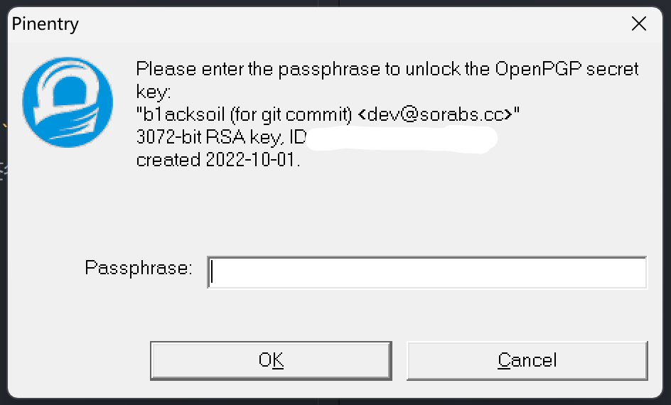
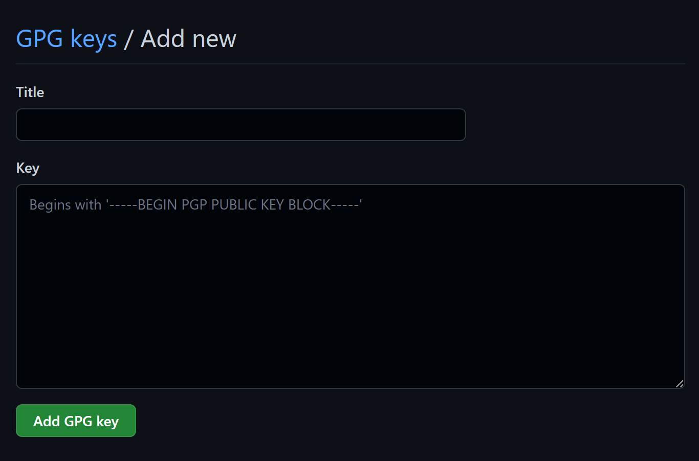
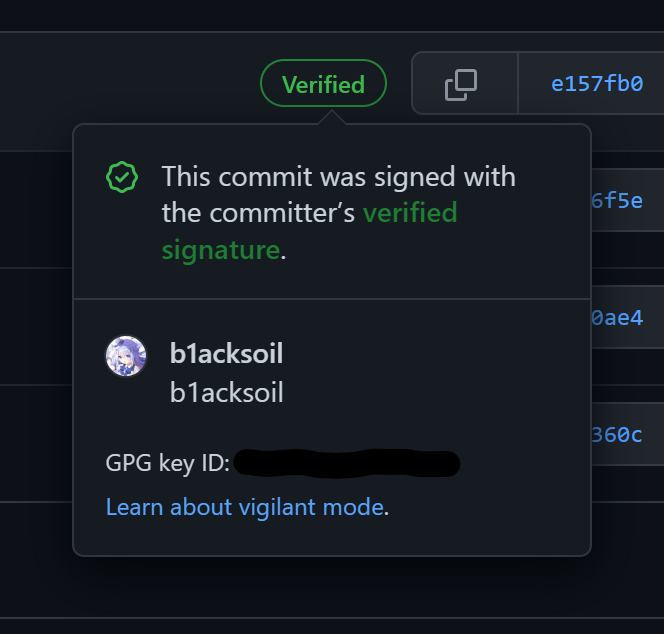

## 前言

在 GitHub 上浏览许多大仓库时，常常能见到在 commit 信息旁边有一个绿色的标识，里面写着 Verified。这种一看就令人安心的标志，自己也想搞一个（）上网查了查资料，发现只要对提交到 GitHub 的 commit 使用 GPG 进行签名即可，步骤也不麻烦，遂进行一个记录。

## 什么是 GPG


GnuPG is a complete and free implementation of the OpenPGP standard as defined by RFC4880 (also known as PGP). GnuPG allows you to encrypt and sign your data and communications; it features a versatile key management system, along with access modules for all kinds of public key directories. GnuPG, also known as GPG, is a command line tool with features for easy integration with other applications. A wealth of frontend applications and libraries are available. GnuPG also provides support for S/MIME and Secure Shell (ssh).

摘自 [GPG 官网](https://gnupg.org/)


简单来说，GPG (GNU Privacy Guard) 是由 GNU 组织提供的一款加密工具，并且是目前世界上最好用的加密工具之一。GPG 的用途十分广泛，而我们今天只是用它进行 git commit 的签名认证。

## 生成 GPG Key

Windows 下安装 Git Bash 已经自带了 GPG 工具，可以使用 `gpg --version` 验证：

```
> gpg --version

gpg (GnuPG) 2.2.29-unknown
libgcrypt 1.9.3-unknown
Copyright (C) 2021 Free Software Foundation, Inc.
License GNU GPL-3.0-or-later <https://gnu.org/licenses/gpl.html>
This is free software: you are free to change and redistribute it.
There is NO WARRANTY, to the extent permitted by law.

Home: /c/Users/b1acksoil/.gnupg
Supported algorithms:
Pubkey: RSA, ELG, DSA, ECDH, ECDSA, EDDSA
Cipher: IDEA, 3DES, CAST5, BLOWFISH, AES, AES192, AES256, TWOFISH,
        CAMELLIA128, CAMELLIA192, CAMELLIA256
Hash: SHA1, RIPEMD160, SHA256, SHA384, SHA512, SHA224
Compression: Uncompressed, ZIP, ZLIB, BZIP2
```

接着我们生成一个新的 GPG key：

```powershell
> gpg --full-generate-key
```

提示输入算法类型，密钥长度，选择默认即可。然后输入自己的邮箱、名称和密钥备注，最后会弹出一个窗口让你设置密码。

生成好密钥后会将密钥的 ID 输出在屏幕上，忘记了也没关系，可以使用 `gpg --list-keys` 查看。

```
> gpg --list-keys

gpg: checking the trustdb
gpg: marginals needed: 3  completes needed: 1  trust model: pgp
gpg: depth: 0  valid:   1  signed:   0  trust: 0-, 0q, 0n, 0m, 0f, 1u
/c/Users/b1acksoil/.gnupg/pubring.kbx
-------------------------------------
pub   rsa3072 2022-10-01 [SC]
      114514191981011451419198101145141919810
uid           [ultimate] b1acksoil (for git commit) <dev@sorabs.cc>
sub   rsa3072 2022-10-01 [E]
```

pub 一栏，在密钥算法和日期下面，就是我们的密钥 ID。

## 使用 GPG 对 git commit 签名

在对 git commit 进行签名之前，我们需要配置一下 git，让它知道我们使用了这个新创建的 GPG 密钥签名 commit：

```
$ git config --global user.signingkey 你的密钥ID
```

为了试试签名的效果，我们随便创建一个测试用的 git 仓库，并进行一次提交：

```
$ mkdir testgpg
$ cd testgpg
$ touch abc.txt
$ git add .
$ git commit -m -S "test gpg key"
```

这里提交时的 `-S` 选项，表示我们使用 GPG 签名这次提交。

不同于以往直接提交成功，git 弹出一个窗口要求你输入密码，也就是我们设置的密钥密码。正确输入后便会完成提交，也就完成了我们第一次由 GPG 验证过的 commit。




可以配置 `git config --global commit.gpgsign true`，这样每一次提交都会自动签名。


## 将密钥导入 GitHub

本地签名好了，我们需要在 GitHub 里添加我们的密钥，否则即使签名了 GitHub 不认，也就没有小绿标了。

首先查看我们的 GPG 公钥：

```
> gpg --armor --export 你的密钥ID

-----BEGIN PGP PUBLIC KEY BLOCK-----

（你的公钥）

-----END PGP PUBLIC KEY BLOCK-----
```

登录 GitHub，点击头像 - Settings，然后打开 SSH and GPG keys 选项卡。


点击 New GPG key，输入想要的名称，然后把上面获取的公钥完整地（包括 `-----BEGIN PGP PUBLIC KEY BLOCK-----` 和 `-----END PGP PUBLIC KEY BLOCK-----`）复制到下面的文本框内，然后点击 Add GPG key 按钮完成。



这时我们就成功地让 GitHub “认识” 了我们的密钥了。本地执行一个提交并 push 到 GitHub 上，你会看到提交信息旁边有一个闪亮的 Verified 标识。



## 附加：信任 GitHub 的 GPG 公钥

虽然我们本地的 commit 已经是签名过的了，但不在本地的，例如直接在 GitHub 网页端执行的提交，则是由 GitHub 代为签名，这导致我们无法验证这些签名的真实性。

信任 GitHub 的公钥即可解决这个问题：

```
$ curl https://github.com/web-flow.gpg | gpg --import
```

回车执行，提示：

```
gpg: key 4AEE18F83AFDEB23: public key "GitHub (web-flow commit signing) <noreply@github.com>" imported
```

这里的 `4AEE18F83AFDEB23` （可能有变化，以实际情况为准）就是 GitHub 的公钥 ID。接下来使用自己的密钥为其签名：

```
$ gpg --sign-key 4AEE18F83AFDEB23

pub  rsa2048/4AEE18F83AFDEB23
     created: 2017-08-16  expires: never       usage: SC
     trust: unknown       validity: full
[  full  ] (1). GitHub (web-flow commit signing) <noreply@github.com>


pub  rsa2048/4AEE18F83AFDEB23
     created: 2017-08-16  expires: never       usage: SC
     trust: unknown       validity: full
 Primary key fingerprint: 5DE3 E050 9C47 EA3C F04A  42D3 4AEE 18F8 3AFD EB23

     GitHub (web-flow commit signing) <noreply@github.com>

Are you sure that you want to sign this key with your
key?

Really sign? (y/N) y
```

输入 `y` 并回车确认，我们便可以看到所有的签名都得到了验证。
